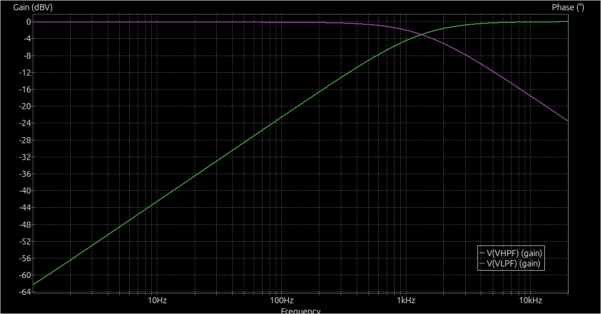
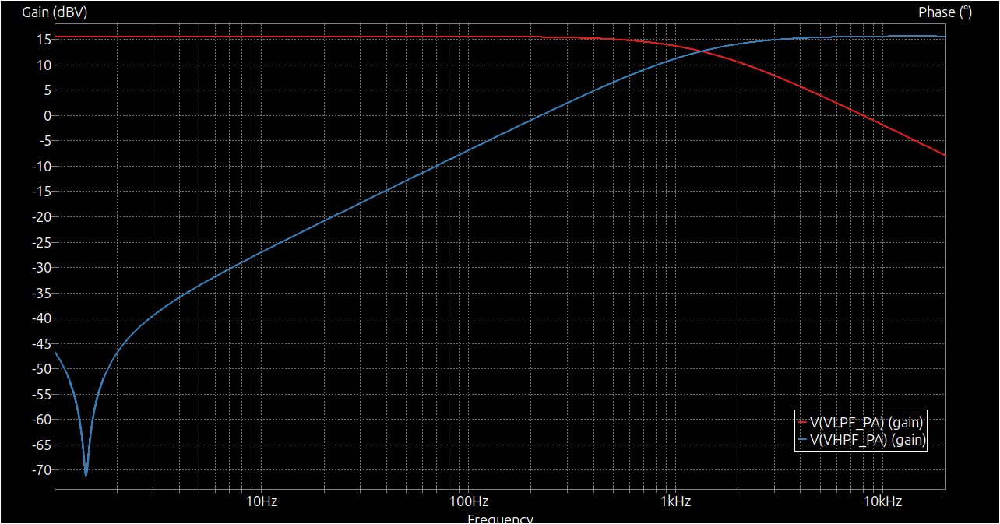
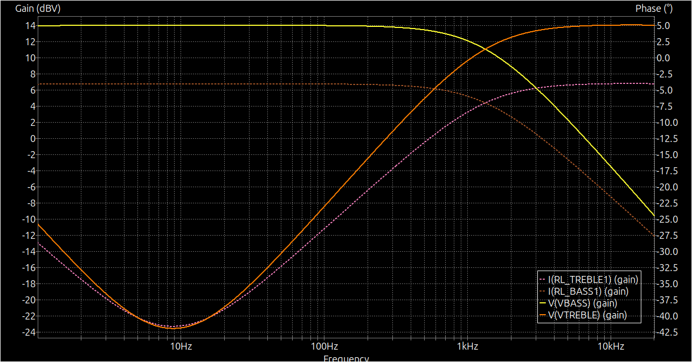

# Speaker Driver

This is a simple analog speaker driver, mostly driven simply by the goal of learning more about this field.

## Features

### Cross-over filtration
The driver is designed to support two drivers, one for bass and one for treble. The cross-over frequency is **1326 Hz**, and is achieved by using simple first order filters.

*   Capacitor: 10 uF
*   Resistor: 12R

### Voltage pre-amplification
The input voltage is amplified by a factor of 6, using a simple non-inverting amplifier (LM741 op-amp). It is expected that the input voltage is around **1 V amplitude (2 Vpp)**, delivered by a 3.5 mm audio connector.

*   Input resistor: 820R
*   Fixed feedback resistor: 10k
*   Variable feedback resistor: 10k (in parallel with the fixed resistor)

### Power amplification
The next stage is a power amplifier, which is a simple class AB amplifier, that allows each driver to draw up to about **5W**. Each driver is expected to have an impedance of **4 Ohm**. TIP31 and TIP32 power transistors are used.

### Power supply
The PCB takes a single 24VDC 1A barrel jack input, and divides the voltage into 12VDC and -12VDC using a simple voltage divider.

## Future work
*   Miniaturize the PCB, using at least SMD components, if not a pre-made amplifier IC.
*   Understand, measure, and reduce the signal-to-noise ratio.
*   Use dedicated battery control circuitry for portable use.
*   Add Bluetooth connectivity (ideally BLE), using a microcontroller.
    *   Ideally, use custom firmware and design a custom antenna on the PCB.
    *   Alternatively, use an ESP32 module with a pre-made antenna.
*   Use buttons for power ON/OFF, volume control, and Bluetooth pairing.
