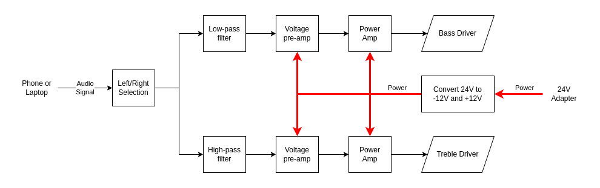
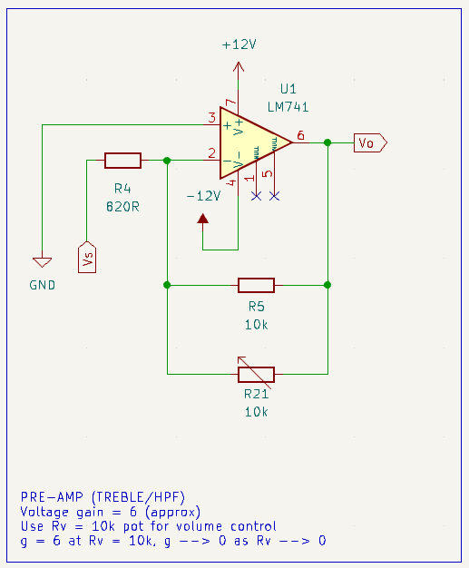
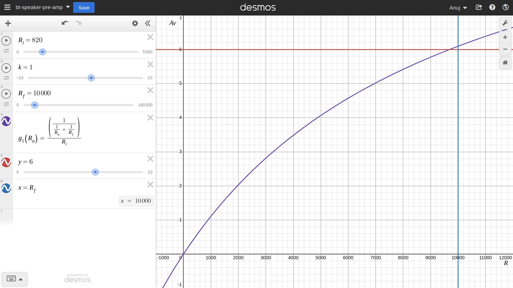
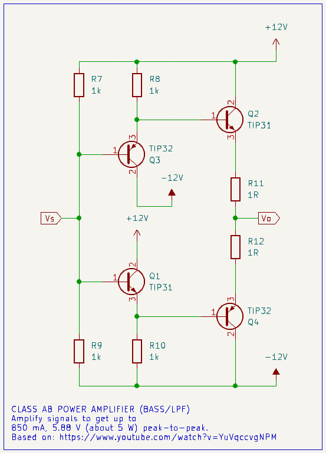

# Introduction
We have built an audio amplifier that handles bass and treble with separate drivers. The goal was to achieve this without using a pre-built amplifier like the popular TDA2030.

This report will cover the following:
1.  Design goals
2.  Overall design
3.  Filter stage
4.  Amplifier stage
5.  Challenges
6.  Schematics
7.  Simulations and expectations
8.  Results

## 2.   Overall design
Our circuit is split into three main stages for each speaker:

*   **Filter:** A high-pass filter for the treble driver and a low-pass filter for the bass driver help select the frequencies at which the drivers respond best. We found good results by setting the cut-off frequency for this around 1.3 kHz.
*   **Pre-amplifier:** This is a simple voltage amplifier based on an op-amp. It provides a voltage gain of about 6, to get our signals to 6 V (peak-to-peak) for the power amplifier.
*   **Power amplifier:** This is a class AB amplifier that can deliver up to 5 W of power to each speaker. It is based on a two pairs of transistors, to get an output current of about 0.8 A.

Power is provided externally by a 24 V DC adapter, and then split to provide -12 V and 12 V.

## 4.   Amplifier stage

### Determining the output voltage

We initially wanted to design for 10 W power output per driver, however, this design would have required various power resistors, proving too expensive. We decided to design for 5 W (per driver) instead.

We found various 10 W speakers commonly available online, and these tend to have an impedance of either 4 or 8 ohms.

Using $R_L = 4\ \Omega$ and $P_o = 5\ W$, the peak output voltage can be determined as follows:

$$\begin{align*}
V_{o(peak)} &= \sqrt{2 R_L P_o} \\
&= \sqrt{2 \times 4\ \Omega \times 5\ W} \\
&= 6.32455532\ V \\
&\approx 6.3\ V
\end{align*}$$

Note that this is an amplitude, so our output varies as $V_o = \pm 6.3\ V$ and the peak-to-peak voltage is $V_{pp} = 2 \times 6.3\ V = 12.6\ V$. Since 12 V is a commonly available voltage, we can design for a peak-to-peak voltage of 12 V and a peak amplitude of 6 V.

### Pre-amplifier
The standard output of from a 3.5 mm audio jack varies between 2.2 V peak-to-peak. Thus, we will need a pre-amplifier to get our signal to 6 V.

Assuming an input voltage of 2 V peak-to-peak (1 V peak), we can calculate the gain required as follows:

$$\begin{align*}
A_v &= \frac{V_o}{V_i} \\
&= \frac{6\ V}{1\ V} \\
&= 6
\end{align*}$$

We can use a simple inverting amplifier to achieve this gain. The gain is given by:

$$A_v = -\frac{R_f}{R_i}$$

However, we would like an adjustable gain, to allow the circuit to have a "volume" control. We can achieve this using a potential divider on the feedback resistor, as shown in the following circuit diagram.

Then, our gain becomes:

$$A_v = -\frac{R_f || R_{vol}}{R_i}$$

Where $R_{vol}$ is the resistance of the potentiometer.

Setting the $R_f = 10\ k\Omega$ and $R_{vol} = 10\ k\Omega$ (since 10k potentiometers are commonly available), we can calculate the feedback resistance as follows:

$$\begin{align*}
A_v &= -\frac{R_f || R_{vol}}{R_i} \\
6 &= -\frac{\frac{R_f R_{vol}}{R_f + R_{vol}}}{R_i} \\
6 &= -\frac{\frac{10\ k\Omega \times 10\ k\Omega}{10\ k\Omega + 10\ k\Omega}}{R_i} \\
6 &= -\frac{5\ k\Omega}{R_i} \\
\implies R_i &= -\frac{5\ k\Omega}{6} \\
&= 833.33\ \Omega
\end{align*}$$

Using commonly available resistor values, we can use $R_i = 820\ \Omega$.

Using this with a graphing calculator, we see that we do in fact achieve a gain of approximately 6.

### Power amplifier
The LM741 op-amp cannot provide sufficient current to achieve the target of approximately 5 W. To get this, we will use a power-amplifier.

The various types considered were:
*   **Class A:** This was the simplest to build and provides the most faithful reproduction of the input sound wave. However, with a theoretical maximum efficiency of 25%, we would have to safely dissipate about 15 W of heat, which was impractical.
    $$\begin{align*}
    P_{loss} &= \frac{P_o}{\eta_{max}} - P_o \\
    &= \frac{5\ W}{0.25} - 5\ W \\
    &= 15\ W
    \end{align*}$$

*   **Class B:** These provide an improvement over the efficiency of a class A amplifier (up to 78.5%), however their cross-over distortion is undesirable for a sound application.
*   **Class AB**: This was chosen for its balance of low distortion, high efficiency (50%-60%), and relatively simple design.
*   **Class D:** While they provide the most efficiency (up to 90%), they were not chosen due to their relatively complex design. Involving digital signals would require us to manufacture a mixed-signal PCB.

Let's calculate the current we need to draw, using $R_L = 4\ \Omega$ and $P_o = 5\ W$:

$$\begin{align*}
I_o &= \sqrt{\frac{P_o}{R_L}} \\
&= \sqrt{\frac{5\ W}{4\ \Omega}} \\
&= 1.118033989\ A \\
&\approx 1.12\ A
\end{align*}$$

We will use the TIP31 (NPN) and TIP32 (PNP) transistors, which have a small-signal gain of 20.

Using this, let's find the base current required:

$$\begin{align*}
I_b &= \frac{I_o}{\beta} \\
&= \frac{1.12\ A}{20} \\
&= 0.056\ A \\
&\approx 56\ mA
\end{align*}$$

The LM741 op-amp can provide a maximum of 2.8 mA, so we will need to use a two-stage power amplifier. Using this will result in a product of gains:

$$\begin{align*}
I_o &= \beta_1 \beta_2 I_s \\
&= 20 \times 20 \times 2.8\ mA \\
&= 1.12\ A
\end{align*}$$

This fits our requirements exactly. However, we will drive the circuit up to only 4.5 W to leave some buffer for thermal considerations. Using this, we get the following output current:

$$\begin{align*}
I_o &= \sqrt{\frac{P_o}{R_L}} \\
&= \sqrt{\frac{4.5\ W}{4\ \Omega}} \\
&= 1.060660172\ A \\
&\approx 1\ A
\end{align*}$$

Our design uses the following Class AB amplifier circuit.

Biasing resistors were mainly chosen due to thermal considerations. Let's calculate the power dissipated by a 1k resistor, with 12 V across it:

$$\begin{align*}
P &= \frac{V^2}{R} \\
&= \frac{(12\ V)^2}{1\ k\Omega} \\
&= 0.144\ W
\end{align*}$$

Common resistors are rated for a quarter watt (0.25 W), so this is a safe choice.